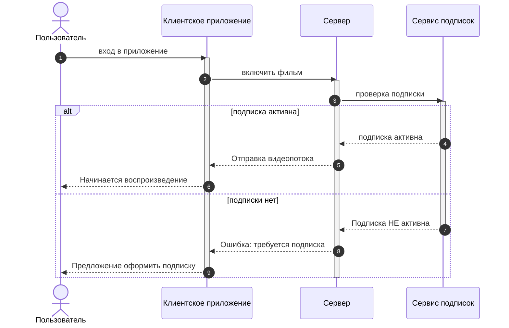
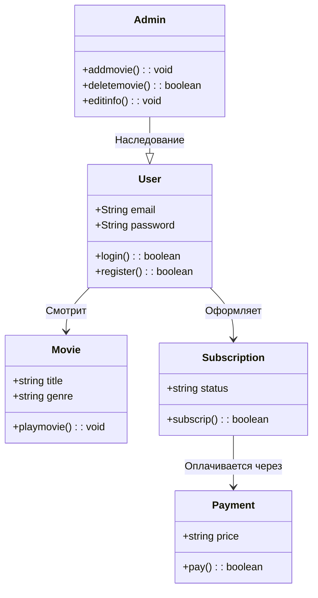
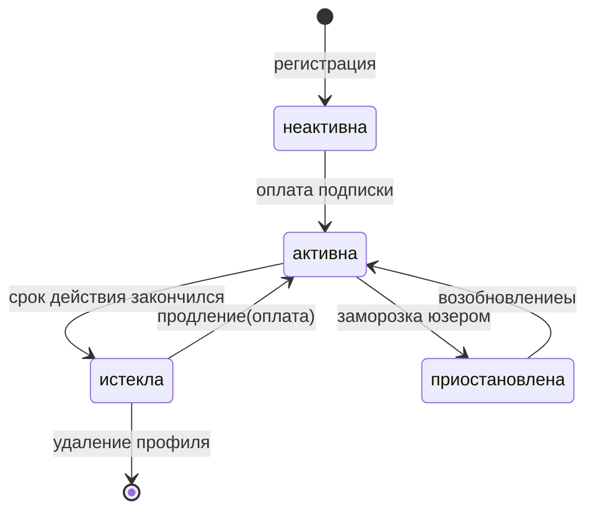
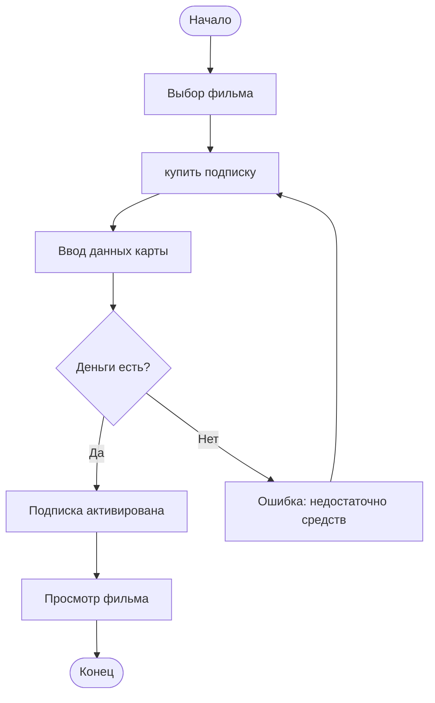

```mermaid

%% 1. Диаграмма последовательности
sequenceDiagram
    autonumber

actor U as Пользователь
    participant App as Клиентское приложение
    participant S as Сервер
    participant Sub as Сервис подписок

U ->> App :вход в приложение
activate App
App ->> S :включить фильм
activate S
S ->> Sub :проверка подписки 
activate Sub
alt подписка активна

Sub -->> S : подписка активна 

S -->> App :Отправка видеопотока
App-->>U: Начинается воспроизведение

else подписки нет 

Sub -->> S :Подписка НЕ активна
deactivate Sub
S -->> App :Ошибка: требуется подписка
App -->> U :Предложение оформить подписку

end
deactivate App
deactivate S
%% 2. Диаграмма классов

```

## 2. Диаграмма классов

```mermaid
classDiagram
    %% Класс Пользователь
    class User {
        +String email
        +String password
        +login() : boolean
        +register() : boolean
    }
    %% класс фильм
   class Movie{
+string title
+string genre
+playmovie() : void

   }
   %% класс подписка
   class Subscription{
    +string status
    +subscrip() : boolean 
   }
   %%класс оплата
   class Payment{
+string price
+pay() : boolean

   }
   %% класс администратор
   class Admin{
   +addmovie() : void
   +deletemovie() : boolean
    +editinfo() : void
   }
Admin --|> User : Наследование
User  -->  Subscription : Оформляет
Subscription -->  Payment : Оплачивается через
User  -->  Movie : Смотрит
```
## 3. Диаграмма состояний

```mermaid
stateDiagram-v2
[*] --> неактивна : регистрация
неактивна --> активна : оплата подписки
активна --> истекла : срок действия закончился
истекла --> активна : продление(оплата)
активна --> приостановлена : заморозка юзером
приостановлена --> активна : возобновлениеы
истекла --> [*] : удаление профиля
```
## 4. Диаграмма деятельности

```mermaid
flowchart TD
Start([Начало]) --> choice[Выбор фильма]
choice --> offer[ купить подписку]
offer --> input[Ввод данных карты]
input --> money{Деньги есть?}
money -- Да --> success[Подписка активирована]
money -- Нет --> error[Ошибка: недостаточно средств]
success --> watch[Просмотр фильма]
 watch --> End([Конец])
    error --> offer
```